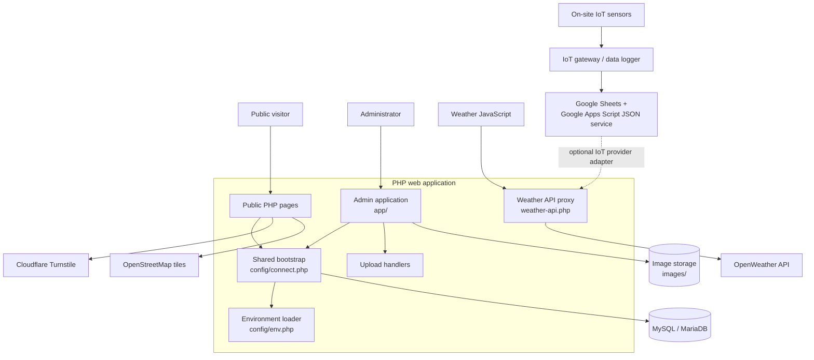
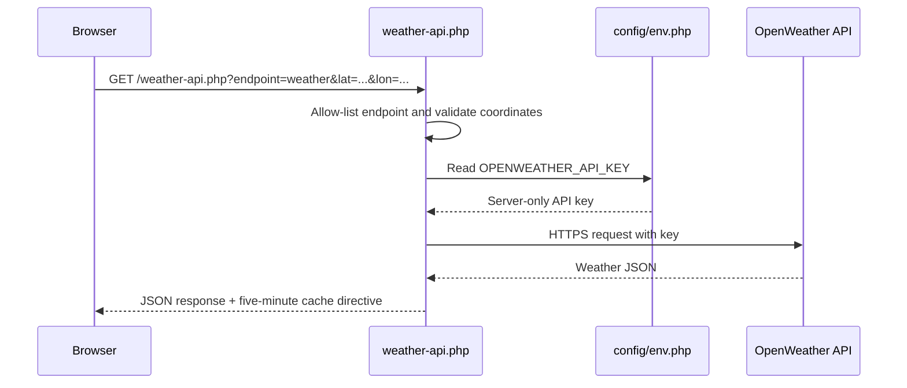
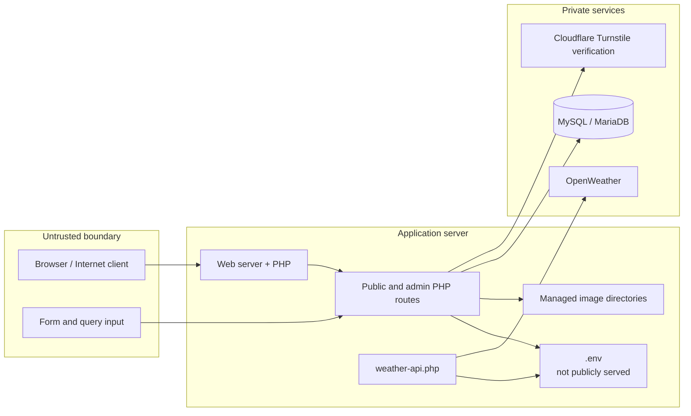
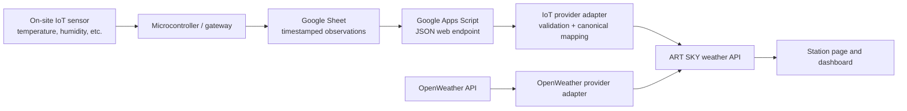
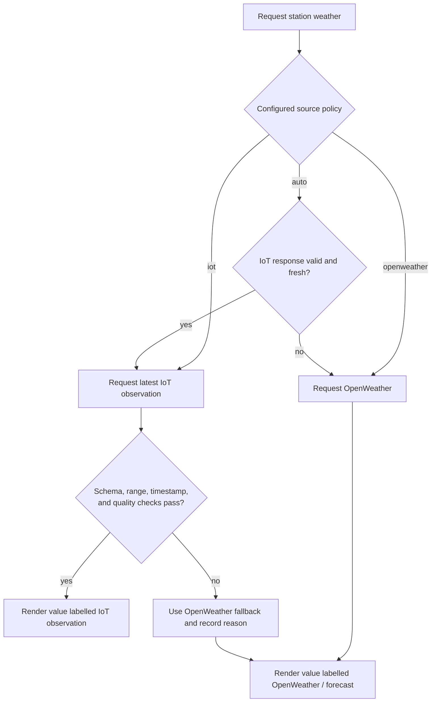
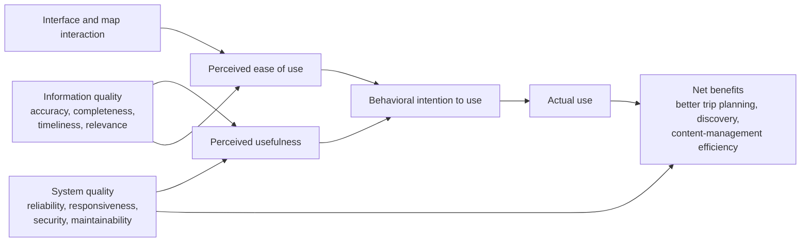
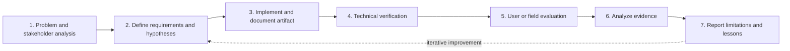

# ART SKY

ART SKY is a server-rendered PHP web application for publishing weather-station information, local news, accommodation listings, car-rental listings, and tourism-oriented content. It combines a public-facing directory with a protected administrative interface for managing the underlying records and media.

The project is intentionally framework-light: pages are rendered by PHP, data is stored in MySQL, and browser-side interactions are implemented with JavaScript libraries already included in the repository. This makes the application approachable for teaching, local deployment, and incremental modernization.

> **Project status.** This is a legacy-style PHP application under active maintenance. Before exposing a fork publicly, review the security notes and rotate every credential that was ever stored in an older revision.

## Capabilities

- Browse weather stations and current/forecast weather data.
- Publish news and blog content linked to stations.
- Register, manage, search, and display hotel and car-rental listings.
- Display location-based content with Leaflet maps.
- Protect public authentication and registration forms with Cloudflare Turnstile.
- Manage stations, hotels, rentals, news, blogs, administrators, and uploads from `app/`.
- Keep database credentials and third-party configuration outside source code through `.env`.

## Architecture

### High-level system design



The diagram separates **human-facing entry points** (public pages and the administrative interface), **shared application services**, and **external dependencies**. PHP renders initial HTML and reads data from MySQL; JavaScript enhances selected pages with map, carousel, and weather interactions.

### Runtime request flow

```text
Browser
  ├── Public PHP pages (index.php, station.php, hotel.php, ...)
  ├── Admin pages (app/)
  └── JavaScript UI libraries (Bootstrap, jQuery, Leaflet, Swiper, Axios)
            │
            ▼
PHP application layer
  ├── config/env.php       Environment-file loader and configuration helpers
  ├── config/connect.php   Session setup, MySQL connection, shared settings
  ├── weather-api.php      Server-side OpenWeather proxy
  └── page-specific PHP    Rendering, validation, CRUD, and upload handling
            │
            ▼
MySQL / MariaDB
  ├── stations, news, blogs
  ├── hotels and hotel images
  ├── car rentals and rental images
  ├── administrators and sessions
  └── analytics-related tables
```

The public pages and administrative pages include `config/connect.php`. That bootstrap file loads `.env`, opens a UTF-8 MySQL connection, initializes session state, and makes shared configuration available to the page. The weather UI calls `weather-api.php`, which validates the requested endpoint and coordinates before requesting OpenWeather with the server-side API key. This design prevents that API key from being embedded in rendered JavaScript.

### Weather request sequence



The browser never receives the OpenWeather API key. The same boundary principle applies to database credentials and the Turnstile secret: they are loaded from `.env` only by server-side PHP.

### Deployment and trust boundaries



For production, the `.env` file and database must be outside the public access boundary. Restrict write permissions to upload locations, enforce HTTPS, and treat all client-provided values as untrusted until validated and authorized.

## Environmental data integration: IoT and OpenWeather

### Data-source rationale

ART SKY can support two complementary classes of environmental data.

- **In-situ IoT observations** are measurements produced by a physical device at or near a named station. They are suitable for local conditions when the device is calibrated, time-synchronised, maintained, and accompanied by provenance metadata.
- **OpenWeather data** are supplied by an external weather-information service using the selected geographic coordinates. They are useful for broad geographic coverage, forecasts, and a fallback where an on-site measurement is unavailable.

These sources are not automatically interchangeable. They can differ in spatial representativeness, observation time, temporal resolution, measurement method, quality control, and whether a value is observed or forecast. A credible research deployment should preserve that distinction in the data model and the user interface.

### IoT-to-portal integration pattern

The repository already keeps three Google Apps Script endpoint settings in `.env` (`GOOGLE_APPS_SCRIPT_DAO_URL`, `GOOGLE_APPS_SCRIPT_DUEAN_URL`, and `GOOGLE_APPS_SCRIPT_FA_URL`) and contains prototype Apps Script code under `googelApscript/`. This supports a lightweight IoT data-publication path in which a device or gateway writes readings to a Google Sheet and a deployed Google Apps Script exposes selected records as JSON.



The Google Apps Script layer is an integration bridge, not an IoT platform by itself. It should expose only the fields required by the application and must not expose Google credentials, edit permissions, or unrestricted spreadsheet data. A production deployment should authenticate or sign data-ingestion requests, restrict endpoint access where feasible, and retain a separate immutable record of raw measurements.

### Canonical observation contract

To display IoT and OpenWeather information consistently, adapters should normalize each provider response into a common schema before the UI renders it. The `source`, `observed_at`, and `quality_flag` fields are essential: they make the origin and fitness of a value visible instead of presenting every number as equivalent.

```json
{
  "station_id": "station-001",
  "source": "iot",
  "observed_at": "2026-08-05T10:15:00+07:00",
  "retrieved_at": "2026-08-05T10:15:03+07:00",
  "latitude": 18.7883,
  "longitude": 98.9853,
  "temperature_c": 29.4,
  "relative_humidity_pct": 72.0,
  "wind_speed_mps": 1.8,
  "weather_code": "clear",
  "quality_flag": "validated",
  "provider_reference": "opaque-upstream-record-id"
}
```

`observed_at` is the measurement time supplied by the provider; `retrieved_at` is when ART SKY received the value. They must not be conflated. Forecast data should also include a `forecast_for` timestamp and be labelled as a forecast in the interface.

### Source-selection and fallback policy

A deployable source-selection design can operate at the station level or request level. The following decision policy makes it possible to switch between IoT and OpenWeather without silently changing the meaning of the displayed data:



Recommended policy values are:

| Policy | Intended use | Display rule |
| --- | --- | --- |
| `iot` | A maintained station where local observations are the authoritative source. | Show the latest accepted reading, timestamp, station name, and quality status. Do not silently substitute a forecast. |
| `openweather` | Locations without local sensors or views requiring forecast information. | Label the provider and indicate whether the value is current conditions or a forecast. |
| `auto` | Resilient public display where IoT readings are preferred only while fresh and valid. | Show IoT when it meets a documented freshness threshold; otherwise show OpenWeather and disclose the fallback. |

The current active `weather-api.php` implementation proxies the OpenWeather endpoints. The Google Apps Script URLs are already configuration-managed, but an active IoT provider adapter, canonical mapping, freshness policy, and UI source indicator must be implemented before claiming that live IoT/OpenWeather switching is operational. This documentation defines the target architecture and the research protocol for that extension.

### Research and data-quality considerations

For a comparative study, treat the IoT feed and OpenWeather feed as distinct observations of related—not necessarily identical—phenomena. Do not use one as an unconditional ground truth for the other. Define a station-specific quality protocol covering sensor placement, calibration, sampling interval, clock synchronization, missing-data handling, outlier rules, and the permissible age of a reading.

Useful evaluation metrics include:

- **Completeness:** proportion of expected observations received in a study interval.
- **Timeliness:** delay between `observed_at` and `retrieved_at`, plus the proportion of readings within the freshness threshold.
- **Validity:** proportion of records passing schema, physical-range, and timestamp checks.
- **Agreement:** mean absolute error, bias, or correlation between sources only when measurements are aligned by variable, location, and time window.
- **Traceability:** proportion of displayed readings that retain source, timestamp, station identifier, and quality metadata.

These measures are consistent with the principle that geographic datasets should carry documented, reportable quality information appropriate to their intended use. [ISO 19157-1:2023](https://www.iso.org/standard/78900.html) provides a relevant quality framework for geographic information.

## Research-informed implementation and evaluation

### Academic positioning

This repository can be presented as a **research-informed software artifact** for a location-based tourism and environmental-information service. It is not, by itself, evidence that a research hypothesis has been confirmed. Any claim of effectiveness, usability, adoption, performance, or security requires a documented study with an explicit method, sample, instruments, analysis, and limitations.

For an academic project, ART SKY can be positioned using a design-science orientation: the software artifact addresses a practical information-access problem, is demonstrated in a real technical environment, and is evaluated against defined quality and stakeholder outcomes. The implementation should therefore be accompanied by a research protocol rather than described only as a collection of web pages.

### Conceptual research model

The following model combines system-quality evaluation with technology-adoption constructs. It is a proposed analytical model for a thesis, paper, or project evaluation; it must be tested with collected data before reporting any causal or statistical conclusion.



The adoption portion is compatible with the Technology Acceptance Model (TAM), in which perceived usefulness and perceived ease of use are central explanatory constructs. The outcome portion can be adapted from the DeLone–McLean information-systems success model: assess quality dimensions, use, user satisfaction, and net benefits as separate constructs rather than treating page views as the sole proof of success.

### Theory-to-implementation traceability

| Research construct | Operational interpretation in ART SKY | Candidate observable measure | Relevant implementation area |
| --- | --- | --- | --- |
| Information quality | Weather, station, hotel, rental, news, and blog data are accurate, complete, current, and understandable. | Expert content audit; percentage of complete records; freshness of weather/news records; user Likert-scale ratings. | MySQL entities, admin CRUD pages, weather proxy, public detail pages. |
| System quality | The system behaves reliably, responds within an acceptable time, and handles invalid requests safely. | Success/error rate; p50/p95 page and proxy response time; availability; invalid-request rejection rate. | `config/`, PHP routes, `weather-api.php`, database. |
| Usability / perceived ease of use | A visitor can find local information and complete essential tasks with low effort. | Task-completion rate, task time, error count, SUS score, TAM ease-of-use items. | Public navigation, search, forms, maps, mobile layout. |
| Perceived usefulness | Users believe the information helps them plan, decide, or manage content. | TAM usefulness items; reported decision support; repeat-use intention. | Station, hotel, rental, news, and admin workflows. |
| Security and trust | Credentials are protected and user-facing actions resist abuse. | Configuration audit; authentication test results; vulnerability findings; user trust items. | `.env`, Turnstile verification, sessions, uploads, access controls. |
| Net benefits | The artifact creates measurable value for visitors and content administrators. | Successful discovery actions, content-publication time, stakeholder interviews, comparative task outcomes. | Public portal and `app/` administration interface. |

### Research questions that this artifact can support

- **RQ1 — Usability:** To what extent can target users locate a station, accommodation, rental service, or current weather information efficiently and correctly?
- **RQ2 — Adoption:** How do perceived usefulness and perceived ease of use relate to intention to use the ART SKY portal?
- **RQ3 — Information quality:** How accurate, complete, timely, and relevant do users and domain experts consider the published content?
- **RQ4 — Software quality:** Does the deployed system meet predefined requirements for functional suitability, reliability, performance efficiency, security, usability, and maintainability?
- **RQ5 — Operational value:** Does the administrative interface reduce the time or error rate required to publish and maintain tourism and weather-related information compared with the current process?

Researchers should select only the questions justified by their study context. For example, RQ2 needs a user survey and an appropriate statistical model; RQ1 needs task-based observation; RQ4 needs technical tests; and RQ5 benefits from a before/after or comparative study design.

### Recommended evaluation protocol



1. **Problem definition.** Identify user groups (for example, tourists, residents, hotel operators, rental operators, and administrators) and document the information-access or content-management problem.
2. **Requirement and hypothesis definition.** Translate the selected research constructs into measurable requirements. Predefine success criteria, such as task completion of at least a stated threshold or a target response-time percentile.
3. **Technical verification.** Test routes, authentication, access control, upload validation, database integrity, and third-party failure behavior. Record the environment, dataset version, browser/device matrix, dates, and test scripts.
4. **Human-centred evaluation.** Use representative participants and realistic tasks. Obtain informed consent when collecting identifiable data. Separate pilot results from the final study sample.
5. **Analysis.** Report descriptive statistics, missing data treatment, reliability of multi-item instruments (for example, Cronbach's alpha where appropriate), and effect sizes/confidence intervals in addition to p-values when inferential tests are used.
6. **Threats to validity.** Discuss sampling bias, novelty effects, self-report bias, network variation, external-service outages, researcher influence, and generalizability limits.

### Measurement design

| Evaluation layer | Example method | Example output | Interpretation boundary |
| --- | --- | --- | --- |
| Functional correctness | Scenario-based acceptance tests | Passed/failed workflows and defect log | Demonstrates conformance to tested scenarios, not absence of defects. |
| Performance | Load test plus server/proxy timing | p50/p95 latency, throughput, error rate | Results apply only to the tested workload and infrastructure. |
| Usability | Moderated tasks and post-task questionnaire | Completion, time-on-task, errors, SUS/TAM responses | Supports claims about the sampled participants and tested tasks. |
| Information quality | Expert review and data audit | Accuracy/completeness/freshness scores | Requires a documented ground truth and review rubric. |
| Adoption | Cross-sectional or longitudinal survey | Construct scores and model estimates | Association does not establish causation without an appropriate design. |
| Security | Code review, configuration review, and controlled security testing | Findings, severity, remediation evidence | A review reduces risk; it is not a guarantee of security. |

### Reproducibility package for a publication

To make a study based on this system auditable and reusable, archive the following alongside the paper or thesis:

- The exact source revision or release tag and a software bill of materials.
- A redacted `.env.example`, never a production `.env` file.
- Database schema/migrations and an anonymized or synthetic dataset where sharing is permitted.
- Research protocol, recruitment criteria, consent procedure, task scripts, questionnaires, scoring rules, and analysis code.
- Deployment specification: PHP version, database version, enabled extensions, server configuration, and third-party API versions/limits.
- Raw de-identified measurements, data dictionary, cleaning decisions, and a replication guide.
- A change log that distinguishes research-prototype behavior from production changes.

### Foundational references

Use the following sources as conceptual and methodological references. Researchers should follow the citation style required by their institution or target venue.

1. Davis, F. D. (1989). *Perceived usefulness, perceived ease of use, and user acceptance of information technology*. **MIS Quarterly, 13**(3), 319–340. [https://doi.org/10.2307/249008](https://aisel.aisnet.org/misq/vol13/iss3/6/)
2. DeLone, W. H., & McLean, E. R. (2003). *The DeLone and McLean model of information systems success: A ten-year update*. **Journal of Management Information Systems, 19**(4), 9–30. [https://doi.org/10.1080/07421222.2003.11045748](https://doi.org/10.1080/07421222.2003.11045748)
3. Hevner, A. R., March, S. T., Park, J., & Ram, S. (2004). *Design science in information systems research*. **MIS Quarterly, 28**(1), 75–105. [https://doi.org/10.2307/25148625](https://doi.org/10.2307/25148625)
4. ISO/IEC. (2023). *ISO/IEC 25010:2023 — Systems and software engineering: Systems and software Quality Requirements and Evaluation (SQuaRE) — Product quality model*. [ISO record](https://www.iso.org/standard/78176.html)
5. National Institute of Standards and Technology. (2025). *NIST SP 800-63-4: Digital Identity Guidelines*. [NIST publication](https://pages.nist.gov/800-63-4/sp800-63.html)
6. Kitchenham, B., & Brereton, P. (2013). *A systematic review of systematic review process research in software engineering*. **Information and Software Technology, 55**(12), 2049–2075. [https://doi.org/10.1016/j.infsof.2013.07.010](https://doi.org/10.1016/j.infsof.2013.07.010)
7. ISO. (2023). *ISO 19157-1:2023 — Geographic information: Data quality, Part 1: General requirements*. [ISO record](https://www.iso.org/standard/78900.html)

## Technology stack

| Layer | Technologies |
| --- | --- |
| Server runtime | PHP 8+ with `mysqli` and cURL extensions |
| Data store | MySQL or MariaDB |
| Server packages | `intervention/image`, `guzzlehttp/guzzle` (managed in `app/composer.json`) |
| Public UI | HTML, CSS, JavaScript, Bootstrap, jQuery, Swiper, AOS |
| Geospatial UI | Leaflet and OpenStreetMap tiles |
| Data requests | Axios and PHP JSON endpoints |
| Bot protection | Cloudflare Turnstile |
| Weather provider | OpenWeather API, accessed through `weather-api.php` |
| Local deployment | Apache/PHP, including MAMP-compatible installations |

## Repository layout

```text
.
├── app/                    Administrative interface and its PHP dependencies
│   ├── admin_admin/         Administrator management
│   ├── admin_blog/          Blog management
│   ├── admin_carrent/       Car-rental management
│   ├── admin_hotel/         Hotel management
│   ├── admin_news/          News management
│   ├── admin_station/       Weather-station management
│   └── admin_uploads/       Upload endpoints
├── assets/                 Public CSS, JavaScript, and vendor assets
├── config/
│   ├── connect.php          Shared database/session bootstrap
│   ├── env.php              Minimal `.env` loader
│   └── function.php         Shared PHP utility functions
├── images/                 Application-managed images, grouped by domain
├── layout/                 Shared public page fragments
├── db_artsky.sql           Database schema and seed/export artifact
├── weather-api.php         OpenWeather server-side proxy
├── .env.example            Safe environment-variable template
└── *.php                   Public entry points and JSON/AJAX endpoints
```

`page_backup/` contains historical copies and is not part of the active application path. Treat it as archival material; do not deploy it as a public route.

## Prerequisites

- PHP 8.0 or newer (PHP 8.1+ recommended)
- Apache or Nginx with PHP configured
- MySQL 8+ or MariaDB 10.4+
- PHP extensions: `mysqli`, `curl`, `mbstring`, `fileinfo`, and `gd`
- Composer, if PHP dependencies must be restored
- An OpenWeather API key and a Cloudflare Turnstile site/secret key pair

## Installation

### 1. Obtain the source

```bash
git clone <your-fork-url> artsky
cd artsky
```

If this project is copied rather than cloned, preserve the directory structure because public pages use relative paths to shared assets and configuration.

### 2. Install PHP dependencies

The project keeps its Composer manifest under `app/`:

```bash
cd app
composer install --no-dev --optimize-autoloader
cd ..
```

### 3. Create the database

Create an empty UTF-8 database and import the included SQL artifact:

```bash
mysql -u root -p -e "CREATE DATABASE db_artsky CHARACTER SET utf8mb4 COLLATE utf8mb4_unicode_ci;"
mysql -u root -p db_artsky < db_artsky.sql
```

Use a dedicated, least-privilege database account in shared or production environments. The application account should have access only to the ART SKY database.

### 4. Configure environment variables

Copy the template and edit the new local file:

```bash
cp .env.example .env
chmod 600 .env
```

The application loads `.env` through `config/env.php`. The file is excluded from version control; only `.env.example` should be committed.

| Variable | Required | Purpose |
| --- | --- | --- |
| `APP_ENV` | Yes | Deployment label, for example `local` or `production`. |
| `APP_URL` | Yes | Canonical base URL without a trailing slash. |
| `APP_TIMEZONE` | Yes | PHP timezone identifier, normally `Asia/Bangkok`. |
| `DB_HOST`, `DB_PORT` | Yes | Database host and port. |
| `DB_DATABASE`, `DB_USERNAME`, `DB_PASSWORD` | Yes | Database connection credentials. |
| `OPENWEATHER_API_KEY` | Yes | Server-only OpenWeather credential used by `weather-api.php`. |
| `TURNSTILE_SITE_KEY` | Yes | Public key rendered for the Turnstile widget. |
| `TURNSTILE_SECRET_KEY` | Yes | Server-only credential used to verify Turnstile responses. |
| `GOOGLE_APPS_SCRIPT_DAO_URL` | Yes | Configured Google Apps Script integration endpoint. |
| `GOOGLE_APPS_SCRIPT_DUEAN_URL` | Yes | Configured Google Apps Script integration endpoint. |
| `GOOGLE_APPS_SCRIPT_FA_URL` | Yes | Configured Google Apps Script integration endpoint. |

Never expose `DB_PASSWORD`, `OPENWEATHER_API_KEY`, or `TURNSTILE_SECRET_KEY` in HTML, JavaScript, screenshots, issue reports, or commits.

### 5. Serve the project

Configure the web server to serve this repository directory over PHP. For a MAMP setup, place it under the configured document root and open the URL corresponding to `APP_URL`.

For a quick local PHP development server:

```bash
php -S 127.0.0.1:8080
```

Then update `APP_URL` to match the local URL. The production server must allow PHP to read `.env` but must never serve it as a downloadable file.

## Configuration and external services

### OpenWeather

Public weather pages request `weather-api.php` rather than OpenWeather directly. The proxy allows only the `weather`, `forecast`, `onecall`, and `uvi` endpoints, validates latitude and longitude ranges, and adds the key only on the server. Ensure PHP cURL is enabled.

Production deployments should add rate limiting and, where traffic is substantial, shared caching at the reverse proxy or application layer. The current endpoint returns a five-minute browser-cache directive.

### Cloudflare Turnstile

`TURNSTILE_SITE_KEY` is necessarily visible to browsers; this is expected for a Turnstile site key. `TURNSTILE_SECRET_KEY` is used only by PHP during token verification and must remain private. Register the production hostname in the Cloudflare Turnstile dashboard before deploying.

### Uploaded media

Images are stored in subdirectories of `images/`. The deployment user needs write access only to the directories used by the upload flows. Avoid granting broad write permissions to the repository, and serve uploads from a location where PHP execution is disabled if the web server supports that isolation.

## Security model and hardening guidance

The environment-variable migration removes active credentials from PHP source files and hides the weather API key from clients. This is an important baseline, not a complete security audit.

Before a production or public open-source release:

1. Rotate database passwords, OpenWeather keys, Turnstile secrets, and integration URLs that existed in prior source revisions.
2. Enforce HTTPS, secure session cookies, and a production `php.ini` with `display_errors=Off`.
3. Review every SQL query and convert remaining string-interpolated queries to prepared statements.
4. Replace legacy reversible password storage with `password_hash()` and `password_verify()`; never use Base64 as password protection.
5. Validate MIME types and file sizes for every upload, generate server-side filenames, and prevent executable uploads.
6. Add authorization checks to every administrative write endpoint and CSRF protection to state-changing forms.
7. Add rate limiting to authentication, registration, and weather proxy requests.
8. Keep dependencies current and scan them regularly.

## Development workflow

### Syntax checks

Run PHP syntax validation for the files you change:

```bash
php -l config/env.php
php -l config/connect.php
php -l weather-api.php
```

### Database changes

Treat `db_artsky.sql` as the baseline schema artifact. For maintainable forks, keep each schema change in a numbered migration, document the upgrade path, and test both clean installation and upgrade scenarios.

### Coding conventions

- Keep shared bootstrap logic in `config/`; do not duplicate credentials or deployment URLs in page files.
- Read secrets through `required_env()` or `env()` rather than hard-coding them.
- Use `htmlspecialchars()` for data rendered into HTML attributes or text contexts.
- Prefer prepared statements for all queries receiving request, session, or database-derived identifiers.
- Keep public page controllers thin and move reusable domain logic into dedicated PHP modules as the project grows.

## Suggested modernization path

The current architecture is suitable for incremental change. A low-risk modernization sequence is:

1. Add automated tests for authentication, authorization, uploads, and JSON endpoints.
2. Convert database access to a repository/service layer with prepared statements.
3. Migrate passwords and enforce CSRF protection.
4. Introduce dependency management for browser assets and a reproducible build process.
5. Separate public uploads from source-controlled assets and add object storage if needed.
6. Optionally migrate page routes into a framework while preserving the existing MySQL schema and public URLs.

## Contributing

Contributions are welcome as focused, reviewable changes. Please:

1. Open an issue or describe the problem and expected behavior.
2. Create a branch with one coherent concern per pull request.
3. Do not include `.env`, database dumps containing personal data, or uploaded production media.
4. Run relevant PHP syntax checks and document manual test steps.
5. Include schema migrations or upgrade instructions when changing database behavior.

## License

No license file is currently included in this repository. A repository is not automatically open source merely because its code is visible. The copyright holder should add an explicit license (for example, MIT, Apache-2.0, or GPL-3.0) before third parties reuse, modify, or redistribute the project.
